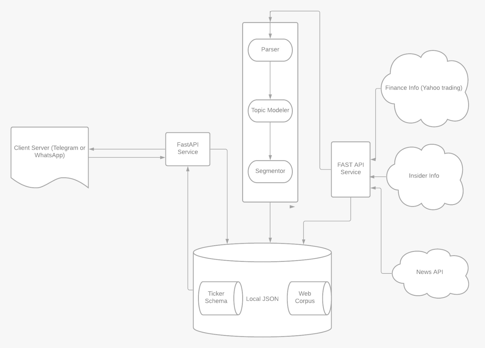

# EV_focus_tool

## OVERVIEW
This is design proposal for the EV Focus Tool (https://github.com/Rohan0401/EV_focus_tool) . The document contains detailed plan to develop tool. 

## EXECUTIVE SUMMARY 
The EV focus tool will help to get the important insider information for the Electric Vehicle (EV) market. Including important trading information of various EV companies. It will help the group to make various investment decisions. It will automate the information processing step which will provide a succinct details about time senstive critical messages. These messages will help us to invest of withdraw during trading. 

## DESIGN DESICION 
- The tool will be designed in python language 
- The code will be maintained on github 
- The code will have OpenAPI specification to interact with the application 
- All the code documents and instruction will be included in the code repository 

## ARCHITECTURE DIAGRAM 


 
## Development Requirements

- Python3.8.2
- Pip
- Poetry (Python Package Manager)

## Running using docker 

- Install docker, docker-compose
- Run `./run.sh <env-name>`, for instance `./run.sh local` for local development

### M.L Model Environment

```sh
MODEL_PATH=./ml/model/
MODEL_NAME=model.pkl
```

### Update `/predict`

To update your machine learning model, add your `load` and `method` [change here](app/api/routes/predictor.py#L13) at `predictor.py`

## Installation

```sh
python -m venv venv
source venv/bin/activate
make install
```

## Runnning Localhost

`make run`

## Deploy app

`make deploy`

## Running Tests

`make test`

## Runnning Easter Egg

`make easter`

## Access Swagger Documentation

> <http://localhost:8080/docs>

## Access Redocs Documentation

> <http://localhost:8080/redoc>

## Project structure

Files related to application are in the `app` or `tests` directories.
Application parts are:

    app
    ├── api              - web related stuff.
    │   └── routes       - web routes.
    ├── core             - application configuration, startup events, logging.
    ├── models           - pydantic models for this application.
    ├── services         - logic that is not just crud related.
    └── main.py          - FastAPI application creation and configuration.
    │
    tests                  - pytest
